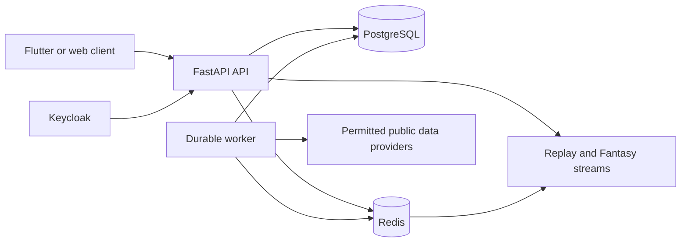
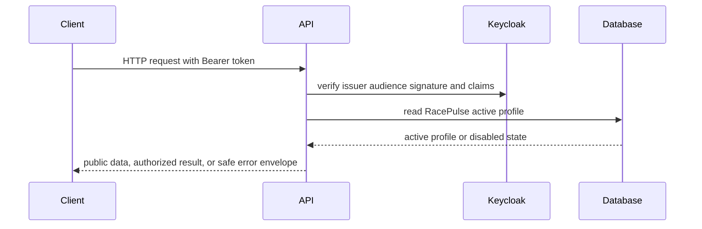
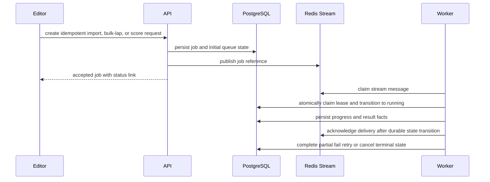
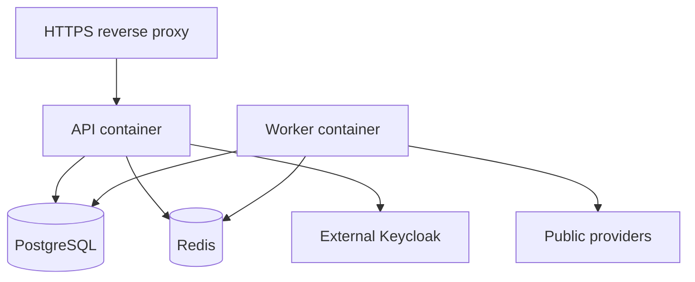

# RacePulse backend architecture

## System boundary

RacePulse is a FastAPI application backed by PostgreSQL and Redis. It imports
permitted public race data, exposes normalized facts and derived analytics,
coordinates durable long-running work, and stores curated content separately
from provider timing facts.



Keycloak is outside the default local Compose topology in all non-development
deployments. It remains the credential and role authority; PostgreSQL stores a
RacePulse active-profile and domain snapshot only.

The default client workflow is described in
[weekend selection and sign-in](weekend-selection-and-login.md). A canonical
year/round has one shared `WeekendDownload` and linked durable job. Session
stage checkpoints persist independently, and the worker loads all provider
channels once per session. Completed stages are reused after a restart.
Every authenticated active request mirrors verified Keycloak identity,
realm/API-client roles and mapped group paths into the local user profile.
Keycloak owns composite-role expansion; local snapshots never grant access.

## Request path and authorization



Public timing and replay reads can remain anonymous. Fan activity requires an
active profile. Active authenticated users may select a shared, rate-limited
weekend download. Editor authority is required for individual provider work,
manual imports/retries, replay-room controls, Fantasy scoring, and editorial changes. Admin
authority controls Keycloak-backed user roles and status.

The API never accepts a client secret from Flutter. Request logging records a
request identifier, route, status, and duration, but excludes Authorization
headers, passwords, Keycloak tokens, confidential client secrets, and raw
provider/cache payloads.

## Durable job path

PostgreSQL is the durable state authority; Redis is a delivery mechanism and
event transport. This prevents a Redis restart or an API process crash from
silently losing a user-visible import or scoring request.



The worker process is started with `python -m app.workers.job_worker`. The job
registry owns all job types rather than introducing separate queue products per
feature. Existing session-import, bounded telemetry-import, and map-import
records retain their domain detail. A common durable execution record supplies
consistent delivery, leases, attempts, retry timing, cancellation, and status
links. Fantasy scoring and finalization use the same path.

Workers reclaim stale Redis consumer-group entries after the matching database
lease interval. A reclaimed stream message still has to claim its PostgreSQL
job before it can run, so replayed transport delivery cannot duplicate work.

Workers use short database transactions around state changes. Provider calls
and bulk processing run outside a transaction that holds a user-facing lock.
Where a handler has a safe work boundary, it rechecks cancellation before
continuing; a cancellation request never relies on forcibly terminating a
provider network call. Workers reclaim only an expired lease. Idempotency keys
and resource-specific active-job uniqueness avoid duplicate external work.

## Data ownership

| Area | Authoritative owner | Notes |
| --- | --- | --- |
| Identity, credentials, realm roles | Keycloak | The backend validates claims and does not store passwords or client secrets. |
| Active RacePulse profile and domain references | PostgreSQL | Disabling a profile blocks an otherwise valid token. Role snapshots are not the authority for grants. |
| Imported timing and telemetry | PostgreSQL with provider provenance | Coverage can be partial and must be disclosed. |
| FastF1 cache | Local named volume or managed cache storage | It is non-authoritative, non-portable, and never committed or baked into an image. |
| Replay room state and fan-out events | Redis | Ephemeral room state has a time-to-live. Clients reload authoritative HTTP state after reconnecting. |
| Durable job intent and result | PostgreSQL | Redis stream entries accelerate delivery only. |
| Curated FIA, team, and Pirelli updates | PostgreSQL | Editors provide source URL, publisher, published time, confidence, and quality metadata. |
| Driver and team biographies | PostgreSQL curated content | Kept separate from timing-derived statistics and their coverage. |

## Race data and derivation layers

```text
public provider data
  -> normalized meetings sessions results laps telemetry
  -> quality and coverage metadata
  -> derived pace tyre strategy attack and replay analysis
  -> API response with provenance and disclaimer
```

Provider facts preserve their source identity and import context. Derived
metrics are reproducible calculations over stored facts and must identify when
coverage, timing quality, or assumptions make them incomplete. Curated content
is never silently merged into imported results.

## Fantasy model

A Fantasy prediction is one Race Weekend Entry per active fan and race
session. Question definitions are generated from the imported meeting schedule,
so absent practice or qualifying sessions are absent rather than invented.

Each question has its own server UTC lock time. Entry progress and question
state are computed from persisted answers and locks. Community percentages are
withheld until the fan answers that question or it locks. Group membership is
capped at 22 and weekend eligibility is snapshotted at the first question lock,
not at a later race-finalization time.

Automatic scoring uses only sufficient imported public timing. Editor-verified
outcomes retain a source reference and quality flags for DNF and uncertain
results. Corrections enqueue an idempotent re-score that deterministically
refreshes finalized private-group podiums and season standings.

## Deployment topology

The supplied Compose configuration is a local or small-environment topology:



For production, run PostgreSQL, Redis, and Keycloak on private networks with
backups, TLS, access controls, and monitored resource limits. Place the API
behind a TLS-terminating proxy that supplies trusted forwarding headers only.
Set `TRUST_PROXY_HEADERS=true` only after that proxy has been configured to
strip client-supplied forwarding headers; otherwise leave it false. Run API and
worker replicas with the same Redis Stream and consumer-group configuration.
Run Alembic as one controlled deployment step before rolling API and worker
replicas; do not execute migrations concurrently in every API container.

The API liveness endpoint is suitable for container process health. Traffic
readiness must additionally require PostgreSQL and Redis when the feature being
served depends on them. Worker health should cover consumer liveness, queue
lag, retry exhaustion, and expired lease recovery rather than merely process
existence.

## Failure handling

| Failure | Expected behavior |
| --- | --- |
| Invalid or expired token | Return a safe 401 response without logging the token. |
| Disabled RacePulse profile | Return 403 even if the Keycloak token has not expired. |
| Keycloak signing keys unavailable | Return a safe dependency error for protected routes. |
| Redis delivery interruption | Durable job remains in PostgreSQL and is republished or recovered by a worker. Replay and optional event fan-out can degrade independently. |
| Provider timeout or transient error | Record a bounded failure reason and retry according to the job policy. |
| Worker crash | Lease expiry makes a safe, idempotent retry possible. |
| Partial public timing | Persist coverage and quality flags; do not claim a complete result or history. |
| Editorial correction | Preserve provenance and enqueue deterministic re-scoring or derived-stat refresh. |

## Operational invariants

- No user-visible durable job exists only in Redis.
- A terminal job state is never moved back to running without an explicit,
  audited retry or requeue operation.
- A disabled profile cannot use a still-valid JWT to perform fan, editor, or
  admin work.
- A Fantasy question lock is evaluated on the server in UTC.
- Curated editorial data always has provenance; timing facts remain distinct.
- Public history responses state their imported-season coverage.
- FastF1 cache content and `.env` files never enter Docker build context,
  source control, API logs, or public responses.
